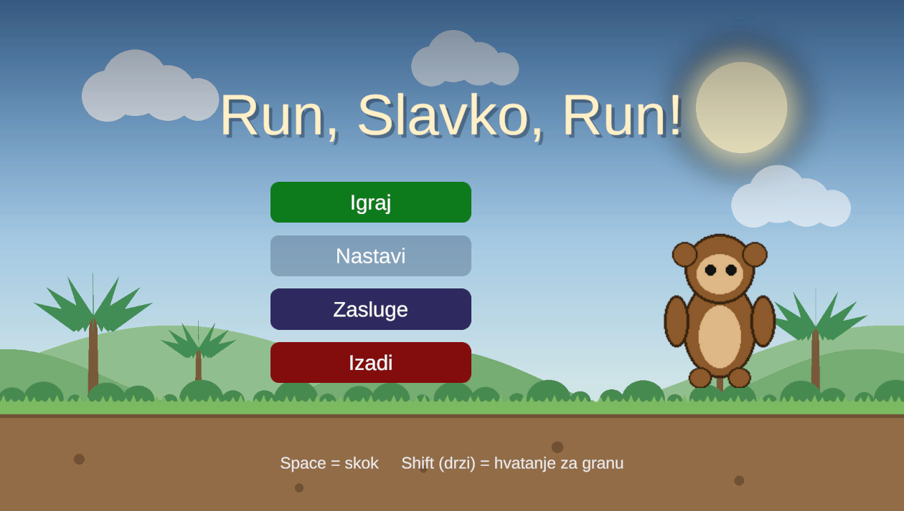
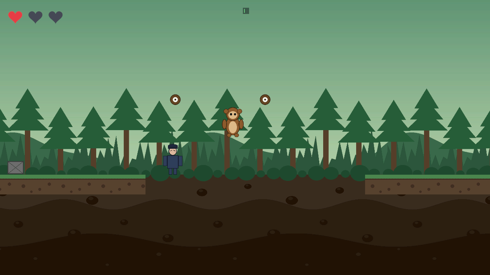
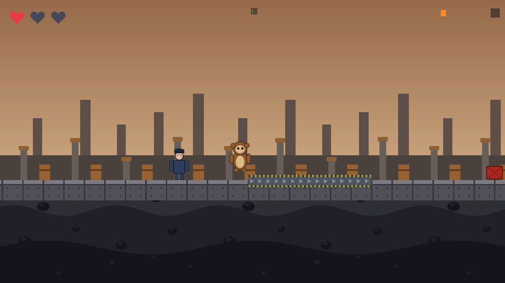

# Run, Slavko, Run!

2D trkački platformer izrađen u Unityju. Majmun Slavko bježi iz zoološkog vrta i
kroz četiri razine trči pred čuvarom, preskače prepreke i prelazi jame njišući se
na užetu.

Igra je izrađena kao završni rad.



---

## Kako pokrenuti

### A) Gotova igra (Windows)

1. Preuzmi `RunSlavkoRun-v1.1.zip` iz zadnjeg izdanja pod
   [Releases](https://github.com/ruzicjakov/run-slavko-run/releases).
2. Raspakiraj ga bilo gdje na disk.
3. Pokreni `RunSlavkoRun.exe` dvostrukim klikom.

Igra se otvara u prozoru 1280 × 720. `RunSlavkoRun.exe` i mapa
`RunSlavkoRun_Data` moraju ostati zajedno — bez te mape igra se neće pokrenuti.

> Izgrađena igra nije dio repozitorija (isključena je u `.gitignore`) jer je riječ
> o izvedenom sadržaju od preko 100 MB koji se u svakom trenutku može ponovno
> napraviti iz izvornog koda.

### B) Iz Unityja

1. Instaliraj **Unity 6000.0.40f1** (Unity Hub → Installs → Add).
2. Unity Hub → **Add** → odaberi mapu ovog projekta.
3. Otvori projekt i u `Assets/Scenes/` dvoklikom otvori **MainMenu**.
4. Pritisni **Play**.

Prvo otvaranje traje nekoliko minuta jer Unity uvozi sav sadržaj.

---

## Upravljanje

| Tipka | Radnja |
|---|---|
| `Space` / `W` / `↑` | skok |
| `Shift` (drži) | hvatanje za granu i njihanje |
| otpuštanje `Shift` ili `Space` | otpuštanje užeta i izbačaj naprijed |
| `Esc` | pauza |

Slavko trči sam — igrač bira samo **kada** će skočiti i **kada** će se uhvatiti.

---

## Pravila

- Slavko ima najviše **3 života**, prikazana srcima u gornjem lijevom kutu.
- **Sudar s preprekom ne oduzima život**, nego Slavka posrne i uspori. Život
  oduzima **čuvar**, ako to izgubljeno vrijeme uspije iskoristiti i stići ga.
- **Pad u jamu** znači trenutni kraj razine, bez obzira na preostale živote.
- Jame su namjerno šire od dometa skoka, pa su **jedini način prelaska njihanje
  na užetu**.
- Razina završava **ciljnim vratima**, koja se vide prije nego se do njih stigne.
- Duž razine su razmještene **kontrolne točke**. Ponovni pokušaj nakon gubitka
  svih života kreće od zadnje prijeđene točke, a ne od početka razine.

### Predmeti

| Predmet | Učinak |
|---|---|
| Kokos | +1 život (do najviše 3) |
| PowerApe | privremeno probijanje lomljivih prepreka |
| Banana Boost | privremeno ubrzanje |

Preostalo trajanje napitka prikazuje se trakom u gornjem desnom kutu.

---

## Razine

Svaka razina zadržava sve mehanike prethodnih i dodaje barem jednu novu. Nova se
mehanika najprije pojavljuje sama, a tek na sljedećoj razini u spoju s ostalima.

| # | Scena | Tema | Brzina | Što donosi novo |
|---|---|---|---|---|
| 1 | `SampleScene` | Zoološki vrt | 6,0 | skok, njihanje, uske i široke jame |
| 2 | `Level2_City` | Grad | 6,5 | viseća prepreka (ispod nje se protrči) i pokretna prepreka |
| 3 | `Level3_Forest` | Šuma | 7,0 | lančano njihanje preko jame od 11 jedinica, brže pokretne prepreke |
| 4 | `Level4_Factory` | Tvornica | 7,5 | pokretne trake i nalet čuvara |

Uz mehanike se razlikuje i izgled: iako sve razine koriste istu skriptu
`Obstacle`, svakoj je temi pridružena vlastita sličica, pa je prepreka u
zoološkom vrtu drveni sanduk, u gradu betonski blok, u šumi panj, a u tvornici
bačva.



*Treća razina: jedan njihaj ne prelazi jamu, pa se u letu mora uhvatiti i drugo uže.*



*Četvrta razina: pokretna traka mijenja brzinu trčanja, a čuvar povremeno kreće u nalet.*

Napredak se sprema nakon svake prijeđene razine, pa gumb **Nastavi** u izborniku
vraća igrača na zadnju otključanu razinu.

---

## Izrada izvršne datoteke

U Unityju: izbornik **Build → Napravi Windows build** (ili `Ctrl+Shift+B`).

Rezultat završi u `Build/RunSlavkoRun/` pokraj mape `Assets`. Skripta sama
pokupi sve scene uključene u Build Settings, pa se ne može dogoditi da razina
nedostaje.

---

## Struktura projekta

```
Assets/
  Scenes/        MainMenu + 4 razine
  Scripts/
    Player/      kretanje, skok, njihanje, životi
    Enemies/     ponašanje čuvara
    Obstacles/   prepreke, pokretne prepreke i točke vješanja
    PowerUps/    predmeti koje igrač skuplja
    Environment/ kontrolne točke, cilj, jame, pokretne trake, paralaksa
    Managers/    tijek igre, sučelje, zvuk, glazba razine, izbornik
    UI/          pauza i pobjednička animacija
    Camera/      praćenje igrača
  Editor/        skripta za izradu builda
  Sprites/       likovi, prepreke, pozadine i pločice tla
  Audio/         glazba i zvučni efekti
tools/           Python skripte koje izrađuju svu grafiku i zvuk
Dokumentacija/   završni rad
Build/           izgrađena igra (nije u repozitoriju)
```

---

## Kako igra radi

**Razine se ne slažu ručno.** Svaka se sastavlja od 14 segmenata širine 28
jedinica, koji se izmjenjuju po vrstama: skok preko prepreke, uska jama, lomljiva
prepreka, široka jama, bonus dionica i dionica za predah. Sadržaj segmenta ovisi
o razini, pa ista vrsta segmenta u gradu donosi viseću prepreku, a u šumi lančanu
jamu. Uz sastavljanje se izvodi i provjera prohodnosti, koja za svaku prepreku
računa mjesto doskoka i zalet preostao do sljedeće opasnosti.

**Njihanje** je izvedeno zglobom `DistanceJoint2D`, koji drži stalnu udaljenost
između Slavka i točke vješanja i time doslovno predstavlja uže. Duljina užeta
uzima se iz stvarne udaljenosti u trenutku hvatanja, pa nema trzaja.

**Čuvar** trči osnovnom brzinom nešto manjom od Slavkove, a ubrzava tek kad
Slavko odmakne. Razmak se zato ustali oko 2,9 jedinica, što je previše za dohvat
— u čistoj vožnji čuvar nikada ne hvata. Postaje opasan tek kad Slavko posrne na
prepreci i izgubi tlo: jedna se pogreška oprašta, ali dvije unutar približno tri
sekunde znače gubitak života. Na četvrtoj razini svakih devet sekundi kreće u
kratak nalet, koji sam po sebi ne stiže igrača, ali mu troši zalihu razmaka.

**Grafika i zvuk izrađeni su programski**, skriptama u Pythonu (Pillow za slike,
NumPy za zvuk), pa u projektu nema preuzetog sadržaja s tuđim uvjetima korištenja.
Skripte se nalaze u mapi `tools/`, zajedno s vlastitim opisom.

---

## Tehnologije

- Unity 6000.0.40f1, Universal Render Pipeline
- C#
- uGUI i TextMeshPro za sučelje
- Python (Pillow, NumPy) za izradu grafike i zvuka

---

## Autor

Jakov Benedikt Ružić — završni rad, Fakultet informatike u Puli, 2026.
Mentor: prof. dr. sc. Tihomir Orehovački.
